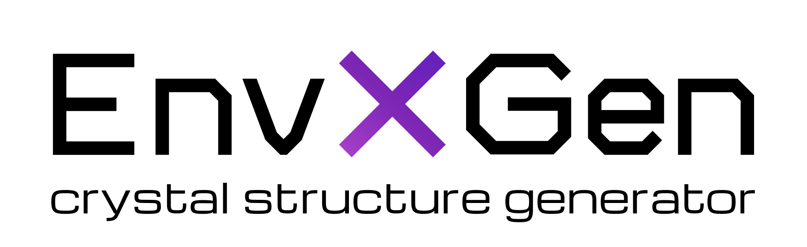

## About EnvXGen

**EnvXGen** is a method for generating and identifying stable crystal structures when partial atomic environments are known (e.g., from experiment).

It works by placing structural elements on a spatial grid within the unit cell, guided by interatomic distance constraints. After structural relaxation, clustering, and similarity analysis, EnvXGen selects the most stable and environment-consistent configuration.

EnvXGen has been successfully tested on:
- Atomic crystals: **UH₈**, **LaH₁₀**, **H₃S**, **Y₂H₉**
- Molecular cocrystals: **CL_20+CO₂**, **CL_20+N₂O**

Furthermore, EnvXGen includes tools to assess the **diversity of generated structures** using:
- Graph Neural Network (GNN) embeddings
- Dimensionality reduction (e.g., UMAP, PCA)
- Clustering algorithms

Tests are available in the [`tests`](./tests) folder, additional data available upon request.


## 🚀 Quick Start

### Prerequisites

- **Python 3.7+** with EnvXGen package
- **SLURM** job scheduler access
- **VASP** with POTCAR files (for atomic crystals)
- **LAMMPS** with force fields (for molecular crystals)

## 📋 Generation Modes

| Mode | Description | Relaxation | Example System |
|------|-------------|------------|----------------|
| `atoms` | Atomic crystal generation | VASP | LaH₁₀ |
| `molecules` | Molecular crystal generation | LAMMPS | CL-20+CO₂ |

## ⚙️ Configuration Setup

### 1. Choose Template

**For Atomic Crystals:**
```bash
cp cfg_for_atomic_crystals_generation.yml cfg.yaml
```

**For Molecular Crystals:**
```bash
cp cfg_for_molecular_crystals_generation.yml cfg.yaml
```

### 2. Basic Configuration

```yaml
Crystal system: LaH10          # System identifier
Mode: atoms                    # atoms | molecules
Relaxation mode: vasp          # vasp | lammps
Number of generated structures: 8
Number of parallel calculations: 4
Pressure (GPa): 0             # Applied pressure
```

### 3. Grid Resolution Settings

```yaml
Number of bins along each lattice vector:
    n_bins_x: 12    # X-direction resolution
    n_bins_y: 12    # Y-direction resolution  
    n_bins_z: 12    # Z-direction resolution
```

### 4. SLURM Job Configuration

```yaml
Calculation settings:
    SBATCH --partition: cpu
    SBATCH --nodes: 1
    SBATCH --ntasks: 8
    SBATCH --time: 00:20:00
```

## 🔧 Setup Requirements

### VASP Mode (Atomic Crystals)

#### Required Files:
1. **📁 INCAR Files** → `EnvXGen/inputs/vasp/`
   - `incar_unfixed` - Standard relaxation
   - `incar_fixed` + `incar_unfixed` - Two-stage relaxation

2. **📁 POTCAR Files** → `EnvXGen/inputs/vasp/potcars/`
   - Download appropriate pseudopotentials for all atom types

3. **📄 Initial Structure** → `POSCAR_init`
   - VASP format crystal structure

#### Configuration Example:
```yaml
Initial Environment:
    Filename: POSCAR_init
    Format: vasp
    Atom types from single atoms:
        La:
            chemical symbol: La
            covalent radius: default

Placed structural elements:
    Single atoms:
        H:
            chemical symbol: H
            number of atoms: 40
            covalent radius: default
```

### LAMMPS Mode (Molecular Crystals)

#### Required Files:
1. **📁 Force Field** → `EnvXGen/inputs/lammps/`
   - Example: `ffield.reax.lg`

2. **📁 LAMMPS Input** → `EnvXGen/inputs/lammps/lammps.in`
   - Relaxation settings and parameters

3. **📄 Initial Structure** → `POSCAR_init`
   - Starting crystal structure

#### Configuration Example:
```yaml
Placed structural elements:
    Molecules from databases:
        H2O:
            name: H2O
            ase_name: H2O
            # Alternative: pubchem_cid: 2244
            number of molecules: 1
            Van der Waals radii:
                H: default
                O: default
```

## Running EnvXGen

### SLURM Submission
```bash
sbatch run_envxgen.sh
```

## 📁 Project Structure

```
your_project/
├── 📄 cfg.yaml                              # Main configuration
├── 📄 run_envxgen.sh                        # SLURM submission script  
├── 📄 POSCAR_init                           # Initial structure
├── 📁 EnvXGen/                              # Main folder with all scripts
│   └── 📁 inputs/
│       ├── 📁 vasp/
│       │   ├── 📁 incars_fixed/             # Fixed-atom relaxation stages
│       │   │   ├── 📄 INCAR_1               # Stage 1 settings
│       │   │   ├── 📄 INCAR_2               # Stage 2 settings
│       │   │   └── 📄 INCAR_n               # Stage n settings
│       │   ├── 📁 incars_unfixed/           # Standard relaxation stages  
│       │   │   ├── 📄 INCAR_1               # Stage 1 settings
│       │   │   ├── 📄 INCAR_2               # Stage 2 settings
│       │   │   └── 📄 INCAR_n               # Stage n settings
│       │   └── 📁 potcars/                  # Pseudopotentials
│       │       ├── 📄 POTCAR_La             # Lanthanum POTCAR
│       │       ├── 📄 POTCAR_H              # Hydrogen POTCAR
│       │       └── 📄 POTCAR_X              # Other elements
│       └── 📁 lammps/
│           ├── 📄 lammps.in                 # LAMMPS input
│           └── 📄 ffield.reax.lg            # ReaxFF force field
└── 📄 log                                   # Execution log
```

## 🛠️ Troubleshooting

| Problem | Solution |
|---------|----------|
| ❌ **Missing POTCAR** | Download from VASP database for all atom types |
| ❌ **LAMMPS Errors** | Verify force field compatibility with your system |
| ❌ **Job Fails** | Check `log` file and validate SLURM settings |
| ❌ **Memory Issues** | Increase `--mem-per-cpu` or reduce parallel jobs |
| ❌ **Timeout** | Increase `--time` in SLURM settings |

## Advanced Features

### Two-Stage Relaxation
```yaml
Relaxation mode: vasp_fixed_and_unfixed
VASP steps: 3  # Number of relaxation stages
```

### Custom Radii
```yaml
La:
    chemical symbol: La
    covalent radius: 1.8  # Custom value in Angstroms
```

### Molecules from Files
```yaml
Molecules from file:
    Custom_Molecule:
        name: MyMol
        Filename: molecule.vasp
        Format: vasp
        number of molecules: 2
```

---

**Ready to generate your crystal structures?** Start with the basic configuration and gradually customize for your specific research needs!
